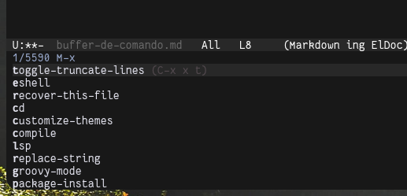

# [Básico](README.md) &#129170; Buffer de Comando

Assim como explicado anteriormente, os buffers são uma visualização pra qualquer conjunto de textos, que podem ou não estar ligadas a um arquivo real no disco. Mas e se eu te falar que literalmente tudo no Emacs é um buffer?

Sim, e tem um que você provavelmente já usou, e nem percebeu: o buffer de comando. Digite a macro `M-x`. Onde o seu mouse foi parar (Provavelmente no canto inferior esquerdo) é esse tal Buffer de comando.

    

O nome é auto-explicativo, o Buffer de Comando é o ponto de entrada para você, usuário. A partir dele, você pode executar comandos que interagem com o emacs.

> Caso você já tenho usado o VSCode, por exemplo, é cabível comparar o buffer de comando com o atalha <Ctrl-Shift-P>, que abre uma toolbar onde comandos interativos podem ser executados.

## Pra quê?

Talvez você esteja se perguntando: Se existem macros que já fazem um ótimo trabalho, por que precisamos de um buffer de comando? O questionamento é válido, e a resposta talvez mais interessante que a pergunta.

Esses comandos tem sim macros :), eles só não são definidos de antemão, mas sim durante o uso/adição/remoção de comandos interativos. Quando você utiliza um comando, o Emacs gera um comando para ser utilizado com ele. Ai vai de você, decorar os milhares de _binds_ gerados para tais comandos, ou só chamar o comando em si.

Vou te dar um exemplo, um comando que eu uso bastante é o `replace-string`. Através dele, consigo encontrar qualquer texto que bata com um regex, e troca-los por um texto em comum.

Teste você mesmo. Selecione uma área do seu texto, abra o buffer de comando (novamente, `<M-x>`) e procure por `replace-string`.

    <a href="./buffers.md">&#129168; Buffers</a>
    ·
    <a href="../README.md">Home</a>
    ·
    <a href="../intermediario/emacs-lisp.md">Emacs Lisp &#129170;</a>

