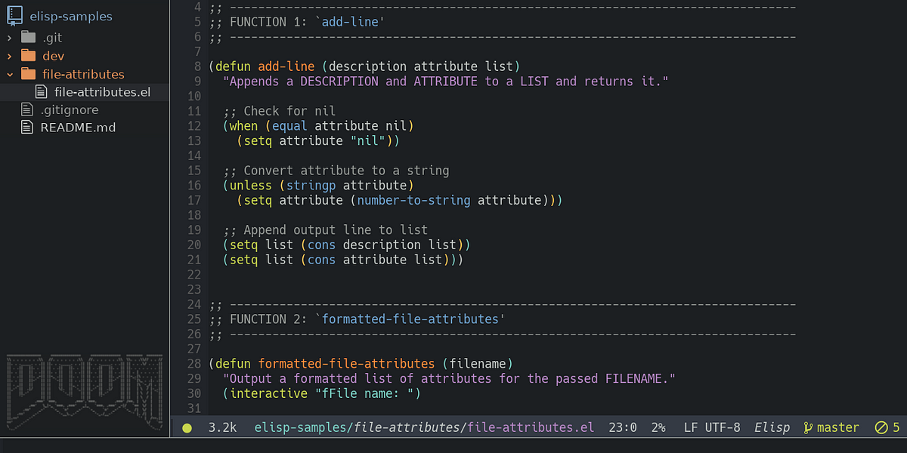
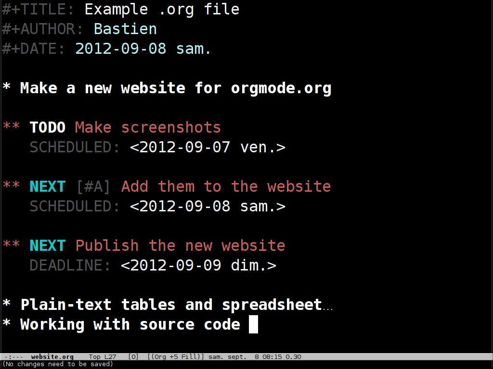
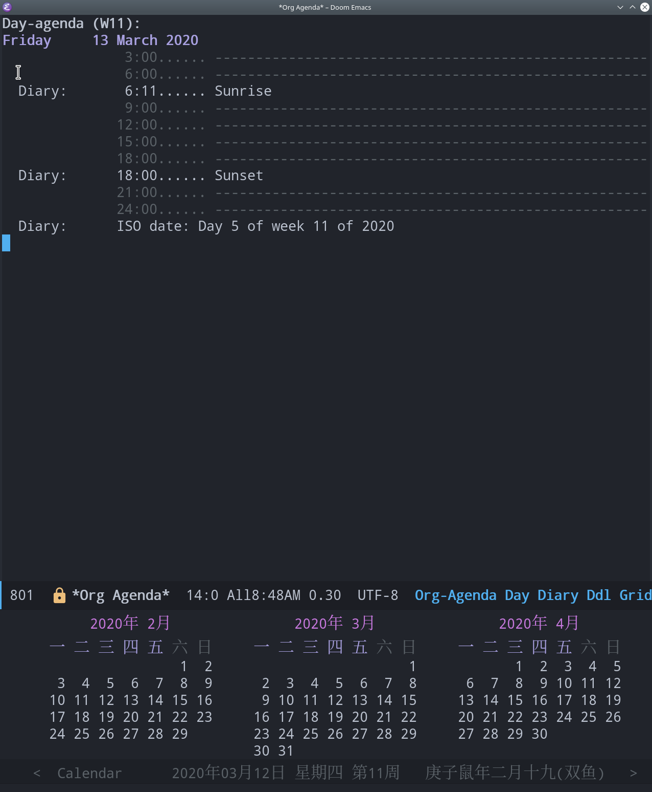

# [Básico](README.md) &#129170; Como o Emacs funciona

O Emacs é um editor de texto, e assim como diversos outros no mercado, como Vim, VS Code, Atom, etc, tem suas peculiaridades que o torna diferente de qualquer outro produto. Algumas delas não são novas, mas são implementadas de maneira diferente; outras, são completamente diferentes e necessitam de uma visão aberta para aprender. Vamos ver algum dos básicos por enquanto. Não se preocupe, você terá uma fundação ótima no fim desse aulão.

## Emacs Lisp

O Emacs é, tecnicamente, um interpretador da linguagem Emacs Lisp (embora seja implementado também na linguagem C). Não é a toa que, daqui alguns passos, você perceberá que praticamente qualquer configuração que queria realizar no Emacs deve ser feita por intermédio dessa linguagem. Não vou discorrer muito sobre a linguagem, já que vou ensiná-la no [módulo avançado](../avancado/emacs-lisp.md); estou apenas apontando a existência.

    

## Macros

Como falei na seção [Antes de começar](../intro/antes-de-comecar.md), o editor tem o nome do acrônimo derivado de Editor MACroS -> EMACS. Essa nomenclatura tem origem da adição da funcionalidade às primeiras versões por Richard Stallman. Algumas macros são simples, como por exemplo, uma combinação de Control + P, que significa `suba uma linha pra cima`; já outras são um pouco mais complexas, chamando funções distintas para um objetivo como compilar um arquivo.

## Customizabilidade

Por ser um interpretador de ELisp (Emacs Lisp), o editor vai muito além de ser somente um editor. Já ouviu aquela frase

> A imaginação é o limite...

Pois então, com o Emacs na mão, você sempre acha a solução. Pra demonstrar, existem diversos aplicativos feitos exclusivamente para o emacs, como por exemplo:

#### [Planejador de projetos / Org Mode](https://www.gnu.org/software/emacs/manual/org.html)

#### [Calendário](https://www.gnu.org/software/emacs/manual/html_node/emacs/Calendar_002fDiary.html)
  
  
 
 

Essa introdução foi um "por baixo dos panos" por trás do editor. Vamos a seguir começar a ver esses conceitos na prática.

    <a href="README.md">&#129168; Básico</a>
    ·
    <a href="../README.md">Home</a>
    ·
    <a href="key-bindings.md">Key Bindings &#129170;</a>

