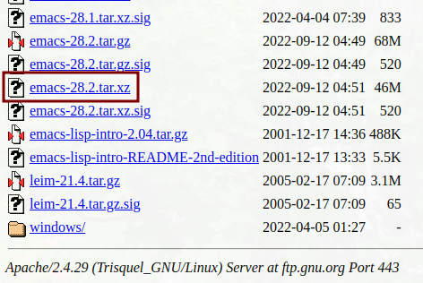
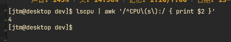
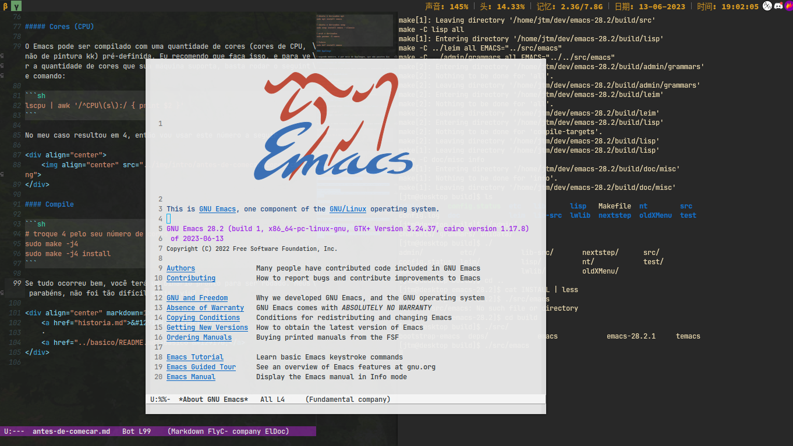

# [Introdução](README.md) &#129170; Antes de começar

Agora que você já sabe um pouco como o Emacs veio a surgir e tornar o tão querido canivete suiço de qualquer programador, vamos agora por a mão na massa de verdade, instalando o editor de texto. Vale ressaltar que existem diversas maneiras de isso ser realizado, e apesar de eu (o escritor) estar utilizando Linux x86_64, vou detalhar instruções que provavelmente serão suficientes, ou que te darão uma luz de como fazer a mesma coisa em outros sistemas. De qualquer forma, o Emacs se trata de um software como qualquer outro, então uma pesquisa rápida no Google não machucará a ninguém.

## Instalação

Irei detalhar o processo de instalação em 3 sistemas diferentes, Linux, Windows e MacOS. Não sou fanático do Linux, mas recomendo muito que, caso queira continuar com precisão esse aulão, o sistema que te dará o melhor conforto (em questão de bibliotecas, toolchain, etc), será o Linux. Além de que é ele que tenho maior propriedade pra te ajudar caso tenha algum problema.

### Linux

Existem três maneiras que você pode realizar a instalação do Emacs no sistema Linux:

#### Generenciador de pacotes

 A primeira, pelo seu gerenciador de pacotes (apt, snap, pacman, yay, entre outros). Eu não vou detalhar todos, mas apenas os mais utilizados no mercado. Caso você utilize um sistema um pouco diferenciado, acredito que se garanta de qualquer forma (pode entrar em contato comigo se tiver qualquer problema).

```sh
# ubuntu e derivados apt
sudo apt install emacs

# ubuntu e derivados snap
sudo snap install emacs --classic

# arch e derivados
sudo pacman -S emacs

# fedora
sudo dnf install emacs
```

#### AppImage

A segunda maneira, é por meio de AppImages, que são pacotes binários de aplicações já agrupados (você pode imaginá-los como um pacote .rar), que ao serem descompactados pelo sistema, podem ser rodados como aplicações normais. A maioria das distros suportam o formato, então é apenas uma questão de executar: https://appimage.github.io/Emacs/.

#### Compilando do código fonte

A terceira maneira é um pouco mais complexa, e necessita um pouco mais de compreensão e habilidade. Recomendo que você iniciante tente compilar o Emacs pelo menos uma vez, pois mesmo que não utilize o binário compilado, isso irá te ensinar um pouco sobre ferramentas do mercado como Shell, CMake, Makefile, te fará entender um pouco por baixo dos panos do Software que você usa, e te tirará um pouco do medo de **Compilar código fonte**.

##### Baixe as dependências

```sh
# ubuntu e derivados
sudo apt install build-essentials
sudo apt build-dep emacs

# arch e derivados
sudo pacman -S $(pacman -Sp --print-format %n emacs)
```

##### Baixe uma release

Entre no seguinte site: <https://ftp.gnu.org/gnu/emacs/>, e escolha um arquivo .tar.xz, copie seu link e cole aqui. Estou pedindo para que faça isso pois a versão que estaremos compilando provavelmente será diferente.

<div align="center">
    
</div>

No meu caso, a mais recente é a 28.2, e é ela que estarei utilizando nesse tutorial. No seu caso, troque 28.2 pela versão que está utilizando.

```sh
wget https://ftp.gnu.org/gnu/emacs/emacs-28.2.tar.xz

tar -xf emacs-28.2.tar.xz

cd emacs-28.2
```

##### Configure

```sh
mkdir build
cd build

../configure
```

##### Cores (CPU)

O Emacs pode ser compilado com uma quantidade de cores (cores de CPU, não de pintura kk) pré-definida. Eu recomendo que faça isso, e para ver a quantidade de cores que sua máquina suporta, basta rodar o seguinte comando:

```sh
lscpu | awk '/^CPU\(s\):/ { print $2 }'
```

No meu caso resultou em 4, então vou usar este número a seguir.

<div align="center">
    
</div>

#### Compile

```sh
# troque 4 pelo seu número de cores de CPU
sudo make -j4
sudo make -j4 install 
```

Se tudo ocorreu bem, você terá um binário pronto para ser rodado. Meus parabéns, não foi tão difícil assim, viu? :)

<div align="center">
    
</div>

## Windows

Para instalar no windows, basta baixar um instalador ou um executável do ftp do GNU: <https://ftp.gnu.org/gnu/emacs/windows/>. Você já instalou milhares de coisas no seu Windows, caso escolhe um instalador MSI, é apenas uma questão de clicar em próximo, próximo, próximo... você me entendeu.

## MacOS

Basta acessar o seguinte website: <https://emacsformacosx.com/>, realizar o download, e a instalação.

## Finalização

Espero que este tutorial tenha te ajudado a instalar o Emacs no seu sistema. Caso não, repito pelo quincuagésima vez, não tenha medo de perguntar. Boa sorte!

<div align="center" markdown=1>
    <a href="historia.md">&#129168; História</a>
    ·
    <a href="../basico/README.md">Básico &#129170;</a>
</div>

