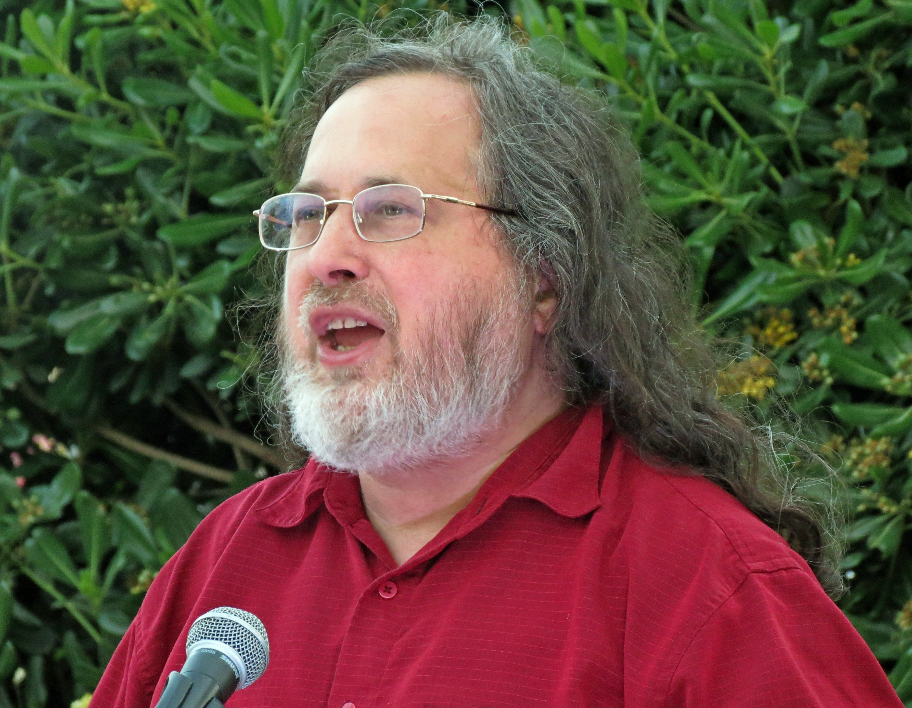
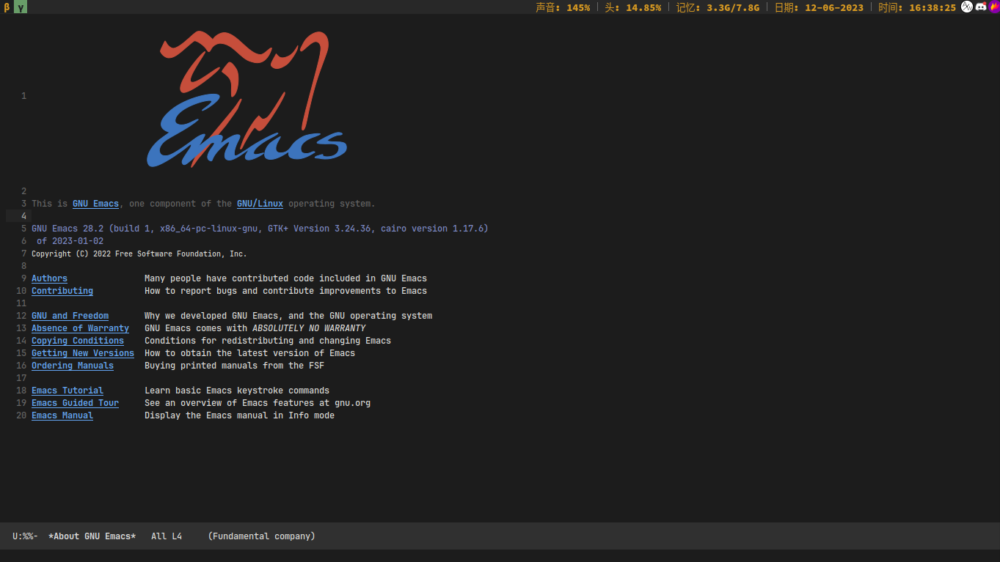

# [Introdução](README.md) &#129170; História

## GNU

Tá vendo esse animal acima? Este foi o mascote escolhido para um dos mais influentes projetos no mundo do Software, o [Projeto GNU](https://gnu.org). Você provavelmente já ouviu falar sobre, mas caso não, talvez os seguintes Softwares que fazem parte do [GNU](https://gnu.org) te esclareçam a mente:

<!--  -->

- Linux
- GCC
- GMake
- Emacs

Infelizmente, esse aulão é sobre o Emacs, então não vou discorrer muito sobre o GNU e a FSF (Free Software Foundation), mas caso tenha interesse, você pode ler um pouco mais nos seguintes websites:

- [Filosofia por trás do Software Livre](https://www.gnu.org/philosophy/free-sw.html)
- [GNU em poucas palavras](https://www.gnu.org/gnu/about-gnu.html)
- [Apresentação de R.MS no TEDx](https://www.youtube.com/watch?v=Ag1AKIl_2GM)

Embora não vamos discutir sobre o GNU em si, a história do próprio Emacs reflete muito da filosofia e propósito da FSF.

## Emacs

### MIT AI Lab

Tudo começou com um simples editor de texto das máquinas [PDP-6](https://www.wikiwand.com/pt/PDP-6) e PDP-10, utilizadas pelo [Laboratório de Inteligência Artificial do MIT](https://www.wikiwand.com/en/MIT_AI_Lab), por volta dos anos 70. Na época era chamado de TECO, acrônimo para Tape Editor and Corrector. Sim, isso mesmo, um editor de fitas de papel perfuradas. TECO utilizava um sistema básico de modals (parecido com o do Vim, com modos de edição, visualização, etc).

    
    

Alguns anos depois, Richard Stallman, futuro criador da Software Foundation e do projeto GNU, entrou em contato com o TECO, e juntamente com outros cientistas do MIT, principalmente Guy L. Steele Jr., aprimoraram, pouco a pouco, versões do TECO, adicionando uma das suas mais importantes funções: Macros. Anos após, essa modificação, unida à edição modal do TECO daria o nome que conhecemos hoje, Editing MACros, EMACS.

### Implementações

Conforme foram passando os anos, a popularidade do Emacs seguiu crescendo para fora do Laboratório do MIT, sendo portado para outras máquinas, sob outros nomes e com diferentes funcionalidades e práticas. São exemplos o Emacs Gosling, feito por ninguém mais, ninguém menos que James Gosling, criador da tão amada linguagem de programação Java.

Foi a partir da versão de Gosling que Richard Stallman, anteriormente citado como o fundador do projeto GNU, escreveu o GNU Emacs, o editor livre utilizado por muitos dos amantes do mundo Open Source / Libre / Free.

Acredito que este curto resumo tenha trazido um pouco do contexto da criação do Emacs. Lembre-se, daqui para frente, qualquer menção ao **Emacs**, estou me referindo especificamente ao **GNU Emacs**.

    <a href="README.md">&#129168; Introdução</a>
    ·
    <a href="../README.md">Home</a>
    ·
    <a href="antes-de-comecar.md">Antes de começar &#129170;</a>

